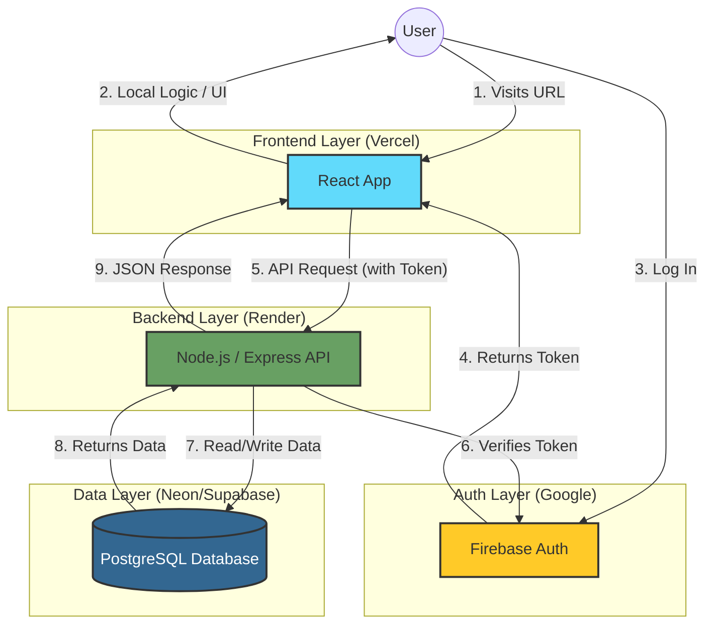

# BookKeeper

A premium, modern web application for managing your book collection.

## Features (Current)
- **Book Identification**: Upload images of your books to automatically extract metadata (Mocked).
- **Multiple Book Detection**: Can handle images containing multiple books.
- **Local Persistence**: All data is saved to your browser's Local Storage.
- **Filtering & Sorting**: Sort by title, author, or date added. Filter by text.
- **Premium UI**: Glassmorphism design with responsiveness.

## Features (Planned)
- **Real OCR Integration**: Replace the mock service with Tesseract.js or Cloud Vision API.
- **Google Drive Export**: Export your collection to an Excel sheet on Google Drive.

## Running Locally

1. Install dependencies:
   ```bash
   npm install
   ```

2. Start the development server:
   ```bash
   npm run dev
   ```

3. Open the link provided (usually `http://localhost:5173`).

## Architecture & Deployment

This project uses a modern "decoupled" architecture, using the best free-tier platforms for each specific task.



### Technology Stack & Platforms

*   **Frontend (Vercel)**:
    *   **What it does**: Hosts the visual part of the app (HTML, CSS, React).
    *   **Why Vercel?**: Specialized for React performance and has a generous free tier.
*   **Authentication (Firebase)**:
    *   **What it does**: Handles User Login (Google Sign-In) and security tokens.
    *   **Why Firebase?**: Secure, free, and easier than building your own login system.
*   **Backend (Render)**:
    *   **What it does**: The "Brain". It runs 24/7 (or wakes on demand), receives requests, checks permissions, and talks to the database.
    *   **Why Render?**: Allows running a standard Node.js server for free.
*   **Database (Neon or Supabase)**:
    *   **What it does**: Persistently stores the book data (Titles, Authors, etc.).
    *   **Why Postgres?**: Professional-grade SQL database available for free on these platforms.

